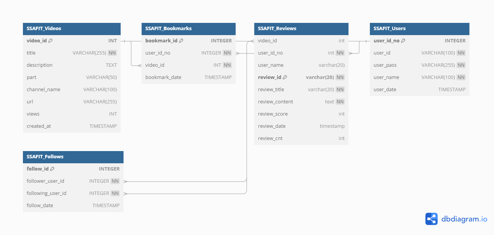

# SSAFIT Project

## Database Table 설계

### 1. SSAFIT_Videos 테이블 (운동 영상 정보)
운동 영상 정보를 저장하는 테이블입니다.

### 2. SSAFIT_Bookmarks 테이블 (찜한 영상 정보)
회원이 찜한 운동 영상을 관리하는 테이블입니다.

### 3. SSAFIT_Reviews 테이블 (운동 영상 리뷰)
운동 영상에 대한 사용자 리뷰를 관리하는 테이블입니다.

### 4. SSAFIT_Users 테이블 (회원 관리)
회원 정보를 관리하는 테이블입니다.

### 5. SSAFIT_Follows 테이블 (팔로우 정보)
회원 간 팔로우 관계를 관리하는 테이블입니다.

## 테이블 간의 관계 (Foreign Key 설정)
- SSAFIT_Bookmarks.user_id_no는 SSAFIT_Users.user_id_no를 참조
- SSAFIT_Bookmarks.video_id는 SSAFIT_Videos.video_id를 참조
- SSAFIT_Reviews.user_id_no는 SSAFIT_Users.user_id_no를 참조
- SSAFIT_Reviews.video_id는 SSAFIT_Videos.video_id를 참조
- SSAFIT_Follows.follower_user_id는 SSAFIT_Users.user_id_no를 참조
- SSAFIT_Follows.following_user_id는 SSAFIT_Users.user_id_no를 참조

