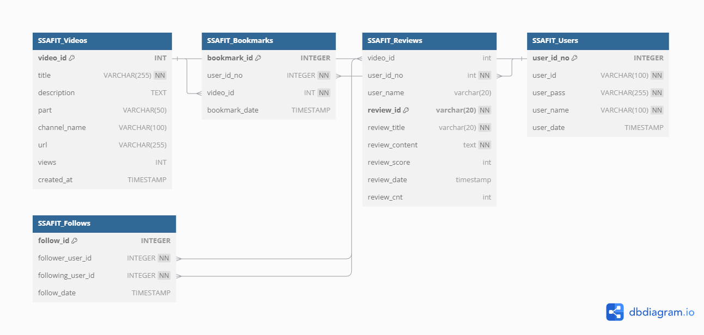

# SSAFIT Project - 데이터베이스 설계

## 프로젝트 개요
SSAFIT 프로젝트는 사용자가 운동 영상 정보를 보고, 리뷰를 남기며, 관심 있는 영상을 찜할 수 있는 웹 애플리케이션입니다. 또한, 사용자는 다른 회원을 팔로우할 수 있습니다. 
이 문서는 이러한 기능을 구현하기 위해 필요한 MySQL 데이터베이스를 설계했습니다.

## 담당한 부분
**Videos 테이블**을 중심으로 설계 및 데이터베이스 구조를 구성했습니다. 이 테이블을 기반으로 사용자가 운동 영상을 조회하고, 이를 리뷰하며 찜하거나 관리할 수 있도록 설계했습니다.

### 주요 기능
- **조회수 기준 운동 영상 출력**: 메인 페이지에서 조회수가 높은 상위 영상을 표시합니다.
- **운동 부위별 영상 출력**: 사용자가 특정 운동 부위를 선택하면 해당 부위에 맞는 운동 영상을 필터링하여 출력합니다.

### 테이블 및 컬럼


#### 1. SSAFIT_Videos 테이블 (운동 영상 정보)
- SSAFIT_Bookmarks.video_id는 SSAFIT_Videos.video_id를 참조합니다.
- SSAFIT_Reviews.video_id는 SSAFIT_Videos.video_id를 참조합니다.
``` sql
CREATE TABLE `SSAFIT_Videos` (
  `video_id` VARCHAR(255) PRIMARY KEY,
  `title` VARCHAR(255) NOT NULL,
  `description` TEXT,
  `part` VARCHAR(50),
  `channel_name` VARCHAR(100),
  `url` VARCHAR(255),
  `views` INT,
  `created_at` TIMESTAMP
);
```

#### 2. SSAFIT_Bookmarks 테이블 (찜한 영상 정보)
- SSAFIT_Bookmarks.video_id는 SSAFIT_Videos.video_id를 참조합니다.
``` sql
CREATE TABLE `SSAFIT_Bookmarks` (
  `bookmark_id` INTEGER PRIMARY KEY AUTO_INCREMENT,
  `user_id_no` INTEGER NOT NULL,
  `video_id` VARCHAR(255) NOT NULL,
  `bookmark_date` TIMESTAMP
);
```

#### 3. SSAFIT_Reviews 테이블 (운동 영상 리뷰)
- SSAFIT_Reviews.video_id는 SSAFIT_Videos.video_id를 참조합니다.
```sql
CREATE TABLE `SSAFIT_Reviews` (
  `video_id` int,
  `user_id_no` int NOT NULL,
  `user_name` varchar(20),
  `review_id` varchar(20) PRIMARY KEY NOT NULL,
  `review_title` varchar(20) NOT NULL,
  `review_content` text NOT NULL,
  `review_score` int,
  `review_date` timestamp,
  `review_cnt` int DEFAULT 0
);
```

### 느낀점 및 배운점
이 프로젝트를 통해 각 테이블 간의 관계를 명확하게 이해하고, 데이터의 무결성을 유지하는 방법을 배웠습니다. 특히, 사용자가 리뷰를 남기고 찜하는 등의 상호작용을 처리하는 방법을 익히면서 실무에서의 DB 설계의 중요성을 체감할 수 있었습니다
- 테이블 간의 관계 설정: 테이블 간의 Foreign Key 설정을 통해 참조 무결성을 보장하는 방법을 익혔습니다.
- PK 활용: 각 테이블의 id 필드를 Primary Key(PK) 로 설정하여 데이터 일관성과 성능을 높이는 방법을 배웠습니다.
- 데이터 정규화: 데이터를 효율적으로 관리하고 중복을 줄이기 위해 정규화를 적용한 테이블 설계 방법을 이해하게 되었습니다.