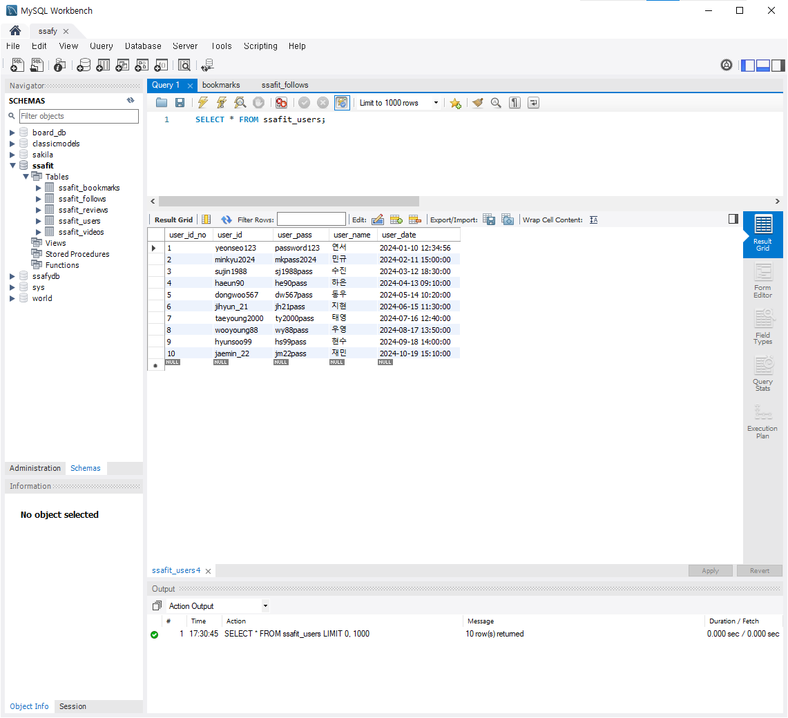
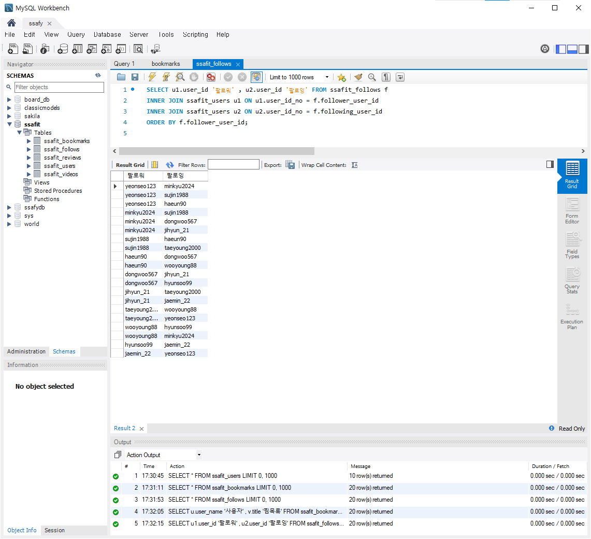

# 양은서_README.md
SSAFIT_DB 관통 프로젝트에 기여한 내용 요약 및 배운 점을 기록한 문서입니다.

## 1. 프로젝트 개요
 이번 프로젝트는 팀원들과 함께 **SSAFIT** 프로젝트의 페이지별 요구사항에 맞춰 데이터베이스 스키마를 작성하고, ERD 다이어그램을 설계한 후 더미 데이터를 통해 테스트한 결과를 공유하는 것을 목표로 하였습니다.

## 2. 프로젝트 진행 순서
 1) SSAFIT 페이지 별 테이블 확인
    - 각 페이지에서 필요한 데이터를 수집하고, 그에 맞는 테이블 정의
 2) 테이블 별 필요한 컬럼 및 데이터 형식 확인
    - 테이블별로 필요한 컬럼과 각 컬럼의 데이터 타입 정의 후 중복되거나 불필요한 데이터 제거
 3) 컬럼명 통일 및 ERD 다이어그램 작성
    - 모든 테이블의 컬럼명을 통일하여 데이터베이스의 일관성을 높였고, 이를 시각적으로 표현하기위해 ERD 다이어그램을 작성
 4) 더미 데이터 삽입 및 테스트
    - 설계된 스키마에 더미 데이터를 삽입하고, 이를 통해 쿼리를 실행하여 데이터베이스의 정확성을 확인

## 3. 주요 기능
 - ERD 다이어그램 : SSAFIT의 각 페이지에 필요한 데이터 구조를 시각적으로 표현
 - 더미 데이터 테스트 : 실제 데이터를 사용하는 대신 더미 데이터를 삽입하여 설계한 테이블과 관계가 잘 동작하는지 확인

## 4. 테이블 구조
 - 테이블 설계는 팀원들과 분업하여 진행하였으며 아래는 제가 설계한 [User, Follow, Bookmark] 테이블 구조를 정리하였습니다.

    ### 1) **SSAFIT_Users**

     | 필드명             | 데이터 타입    | 설명                                     |
     |--------------------|----------------|------------------------------------------|
     | `user_id_no`       | `int`          | 자동 증가, PK                    |
     | `user_id`          | `varchar(100)` | 사용자의 고유 ID, UNIQUE |
     | `user_pass`        | `varchar(255)` | 사용자의 비밀번호                          |
     | `user_name`        | `varchar(100)` | 사용자의 이름                              |
     | `user_date`        | `timestamp`    | 가입 날짜, 기본값은 NULL                  |

     **기능 및 특성**
     - `user_id_no`는 기본 키이며, 자동으로 증가하는 고유한 값으로 설정됨
     - `user_id`는 고유한 값이 되어야 하며, 중복된 ID를 허용하지 않음 (`UNIQUE KEY`)
     - 비밀번호는 최대 255자까지 저장 가능하며, 보안을 위해 충분한 길이를 허용함
     - `user_date` 필드는 사용자의 가입 날짜를 기록하며, 기본값으로 NULL이 설정될 수 있음
     
     

    ### 2) **SSAFIT_Follows**

     | 필드명               | 데이터 타입 | 설명                                    |
     |----------------------|-------------|-----------------------------------------|
     | `follow_id`          | `int`       | 자동 증가, PK                   |
     | `follower_user_id`   | `int`       | 팔로우를 하는 사용자의 `user_id_no` 참조  |
     | `following_user_id`  | `int`       | 팔로우를 당하는 사용자의 `user_id_no` 참조|
     | `follow_date`        | `timestamp` | 팔로우 날짜, 기본값은 NULL               |

     **기능 및 특성**
     - `follower_user_id`와 `following_user_id`는 각각 `ssafit_users` 테이블의 `user_id_no`를 참조하며, 외래 키 제약 조건이 적용됨
     - `ON DELETE CASCADE` 옵션으로, 해당 사용자가 삭제되면 관련된 팔로우 관계도 자동으로 삭제됨
     - `follower_user_id`와 `following_user_id`에 인덱스가 설정되어 있어, 빠른 조회가 가능함

     
     

    ### 3) **SSAFIT_Bookmarks**

     | 필드명             | 데이터 타입    | 설명                                    |
     |--------------------|----------------|-----------------------------------------|
     | `bookmark_id`      | `int`          | 자동 증가, PK                   |
     | `user_id_no`       | `int`          | 북마크를 저장한 사용자의 `user_id_no` 참조 |
     | `video_id`         | `int`          | 북마크된 비디오의 `video_id` 참조          |
     | `bookmark_date`    | `timestamp`    | 북마크한 날짜, 기본값은 NULL              |

     **기능 및 특성**
     - `bookmark_id`는 기본 키이며, 자동으로 증가하는 고유한 값으로 설정됨.
     - `user_id_no`는 `ssafit_users` 테이블의 `user_id_no` 필드를 참조하며, 외래 키 제약 조건이 적용됨.
     - `video_id`는 `ssafit_videos` 테이블의 `video_id` 필드를 참조하며, 외래 키 제약 조건이 적용됨.
     - `bookmark_date` 필드는 사용자가 비디오를 북마크한 날짜를 기록하며, 기본값으로 NULL이 설정될 수 있음.
     - `user_id_no`와 `video_id` 필드에는 각각 인덱스가 설정되어, 검색 속도를 향상시킴.

     
     

## 5. 프로젝트를 통해 배운 점 / 느낀 점
 - 팀원들과 Database 설계하는 과정을 통해 데이터베이스 설계의 중요성을 배우게 되었습니다. 정규화와 비정규화 과정을 자세히 공부할 수 있는 기회가 되었고, 시스템 성능을 고려하여 설계하는 것이 매우 중요하다는 것을 깨달았습니다. 
   
- Auto increment 되는 ID 컬럼을 PK로 사용할 때의 장점에 대해서도 배웠습니다.    
 첫 번째로 **일관성**이 있습니다. 각각의 테이블의 PK를 동일하게 auto increment 컬럼으로 설정하면, 다른 테이블의 PK를 추적하거나 확인하는 작업이 줄어들게 됩니다.    
 두 번째로 **효율성**입니다. MySQL에서는 PK를 설정하면 해당 값을 인덱스로 사용하여 B-Tree 구조로 저장하게 되는데, PK가 자동으로 증가하는 숫자라면 데이터가 자연스럽게 정렬된 순서대로 추가되어 인덱스 유지 관리 비용이 줄어듭니다.    
 세 번째로 **확장성**입니다. 각 테이블이 ID별로 순차적으로 쌓여 있기 때문에, 향후 확장 시에도 데이터 처리와 관리가 더 수월해집니다.   
 유니크한 값으로 PK를 설정하고 Index를 설정하는 방법도 고려해보았으나, 추후 인덱스가 너무 많아질 경우 성능에 영향을 줄 수 있는 점을 고려하였을 때, Auto increment되는 ID 컬럼을 사용하는 것이 유리하다고 판단하였습니다. 이러한 이유로유니크한 값인 `USER_ID` 컬럼이 아닌 auto increment되는 `USER_ID_NO`로 설정하게 되었습니다. 이번 경험을 통해 성능 최적화와 확장성을 동시에 고려할 수 있었습니다.
